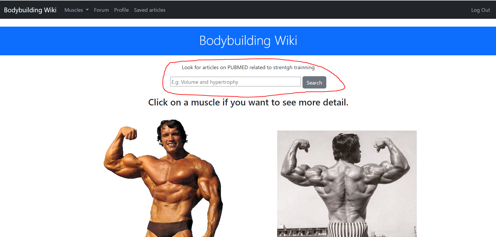
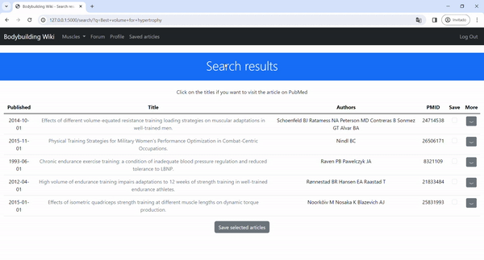
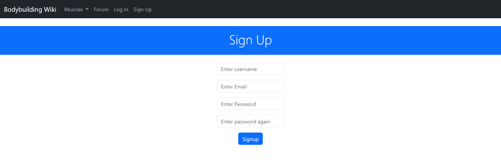

# Bodybuilding Wiki - A web application for strentgh trainning enthusiasts.
#### Video Demo:  <URL HERE>
#### Description:
This a web application that has multiple functionalities. It's aimed for bodybuilding enthusiasts.

On this webpage users can see info about the different muscles that can be trained, they can also see a list of exercises to train each muscle.

This webpage has a forum where users can discuss different topics related to bodybuilding.

The most worked on aspect of this web application is it search function, this allows users to look for articles on PubMed related to strength trainning. Using the Eutilities API to retrieve the most relevant articles. this is possible because the program filters the results by searching through a list of selected journals (Later is shown how to change this variable).

## Installation.

### Step 0: Clone this repository.
`git clone https://github.com/PabloLorenzo123/bodybuilding-wiki.git`

### Step 1: Create a virtual environment.
`python -m venv .venv`

`.venv/Scripts/Activate` to start the virtual environment.

### Step 2: Install requirements.
`pip install -r requirements.txt`

### Step 3: Initialize database and create the tables.

`flask shell`

`db.create_all()`

`db.commit()`

### Step 4: Create the objects neccesary.
`flask shell`

`Role.insert_roles()` This will create the roles in the database like 'user' and 'admin'.

`Muscle.insert_muscles()` This will create the neccesary muscle objects.

### Step 5: Create the admin user.
In project/__init__.py change 'ADMIN_EMAIL' to the email you want your admin to have, in this case by default is pablo@email.com.
create an User with that email.
`flask shell`

`admin = User(name='yourname', email='your_admin_email', password='your_password')`

`db.session.add(admin)`

`db.session.commit()`

### Step 6: Run the application.
`python app.py`, visit in your browser http://127.0.0.1:5000/

## Techstack
This project is built on Flask a python library used for creating web applications.
The frontend is CSS, Html and JS, using the Bootstrap library.
The database is SQLite.

## Purpose
Many fitness enthusiasts are confused by the vast amount of contradiction on social media about trainning.
This Webpage tries to make this a little bit easier, by offering education about how each muscle works and where it is located, and also providing exercises to train them.

In this app is integrated a search system that look for studies about the topic the user want to learn about related to strength trainning. Users can discuss different topics on the Forum.

## Article search
This app has a search input field in the homepage, that allow users to get articles related to what they ask for in the context of strength trainning.
This is done thanks to the Eutilities Api, esearch, esummary and efect.

For instance if i look for 'Best volume for hypertrophy', a search results page will appear with the most relevant studies related to the topic.

On this page we can see a table of x amount of articles retrieved, if the user clicks on the title of an article he will be redirected to the article published on Pubmed.

the amount of rows can be changed in project/search/search_json.py in the dictionary params, change the key 'retmax' to the amount of rows you want.

Search settings, you can change these parameters if you like. If you want to use another database that isn't PubMed of the Eutilities, retrieve the data in XML format or to retrieve more results per search with 'retmax', you can change this dictionary.

If the see more button is clicked, a row is added to the table where details of the article is shown.

The details fields can vary between articles. The articles can have abstract, results, or conclusions.

### Save article
Articles can be saved, so they can be later revisited. you can save one article at a time, when one is saved the user's redirected to a page containning the articles saved. On this page an article can be deleted from the user's saved articles.

### Exception handling.

If a user already has an article saved, he can't save it again.

### Esearch
Esearch looks for the ids of the articles that match the query, and we also provide in the code extra parameters. this query will be executed on the Pubmed database, and a parameters journals is added, this is very important because these journal allow the query to be contextualized to strength trainning.

the list 'selected_journals' located in project/search/search_json.py is set the journals to look for.

This is important because it creates a context, if selected journals were not defined, the user would need to be precised with his query to get the results he wants. For instance if he searchs for 'volume' volume could be in any article in PubMed that's not strentgh trainning related.

the reason there are two files to do search is because at first i tried to do it in XML because i thought this API couldn't return JSON data, later i discovered this fact and then decided to change the code. If you want to use XML you can use the XML search file, it doesnt work as well but there's a blueprint.

### Esummary and Efecth.
Thanks to Esummary and Efectch utilities we can retrieve the data of the articles found by Esearch. this allow to fill the table columns, and allow us to see detail of the article like abstract, results and conclusions.

Efecth can't retrieve data in JSON format, i had to do work with XML, using the xml.etree library.

## User Authentication
I used the third party flask-login to help me with the login, signup, and logout.

For user authentication i needed two tables, one for users and another for roles. With this i can control who has access over certain features of the application. Admins can post exercises and update muscle information, as well as update users profiles. Users can post on forums, see articles and save them.

These forms handle exceptions.

You can see how the 'users' and 'roles' table are defined in project/models.py users have a role, they are related to posts and related to the articles they save.

There's also a profile page where user can see their information, the post they've made and edit their info.

## Muscle information
On the homepage there's a photo of a bodybuilder which muscles are clickable if you want to know more detail about them. Also in the navbar there's a button that opens a menu with all the muscles registered.

When you click on a muscle you can see its description and also a list of exercises.

You can click on the exercise's title to see more details.

If you're an admin you can add exercise to the muscle, and edit the details of the muscle.

## Forum
This app also has a forum, where users can discuss the topics they wish. Someone needs to create a post, and other users can comment about it.
For this i used two tables one called 'posts' and other 'comments'. You can see their definition in project/forum/models.py

## Application file organization.
In the root folder we can find app.py, this is the file executed the flask application is runned. This file imports the create_app function inside project/__init__.py, and then runs the application.

In the project folder is all the flask application code.

- In project/__init__.py the create_app function is defined, the third parties libraries are imported and initialized. In project/models.py the User and Role database models are defined.

- In project/search we can find everything related to the search aspect of the application, in search_json is the code the requests to the API are made and processed, in views.py we handle the GET request of the search function. The 'save article' and 'delete article' functionality is found here too. in project/search/models.py we find the database model PaperSaved that relates all the articles the user have saved.

- In project/muscle is defined the views and models related to the muscles functionality of the app. That is the Muscle and Exercise database models. and their views.

- In project/forum we can find everything related to the forum aspect of the application, the database models Post and Comment and the views related to the forum.

- In project/main we find the views related to the user profile customization and the view for the home page.

- In project/auth we find the views and forms related to user authentication, like login, signup and logout.

## Acknowledgements.
- Thanks to Miguel Grinberg, author of the book Flask Web development - Developing web applications with python 2nd Edition. This book gave me a foundation on Flask that helped me create this project. I also got inspired by his way to structura an application and the design of the 'roles' and 'users' tables.

- Thanks to CS50 for the free knowledge, and for being a great course.x