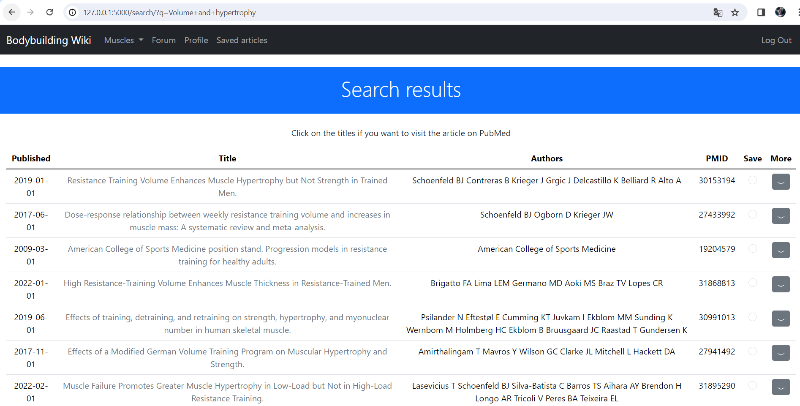

# Bodybuilding Wiki
#### Video Demo:  <URL HERE>
#### Description:
This a web application that has multiple functionalities. It's aimed for bodybuilding enthusiasts.
On this webpage users can see info about the different muscles that can be trained, they can also see
a list of exercises to train each muscle.

This webpage also has a forum where users can discuss different topics related to bodybuilding.

The most worked on aspect of this web application is it search bar in the home page, that allows
users to look for articles on PubMed. The program using the Eutilities API retrieve the most relevant
articles related to what the user asked related to bodybuilding. this is possible because the program filters the
results by searching through a list of selected journals (Later is shown how to change this variable).

### Techstack
This project is built on Flask a python library used for creating web applications.
The frontend is CSS,Html and JS, using the Bootstrap library.
The database is SQLite.

## Article search
This app has a search input field in the homepage, that allow users to get articles related to what they ask for.
This is done thanks to the Eutilities Api, esearch, esummary and efect.

For instance if i look for 'Best volume for hypertrophy', a search results page will appear with the most relevant studies related to the topic.

On this page we can see a table of x amount of articles retrieved, the amount of rows can be changed in project/search/search_json.py in the dictionary params, change the key 'retmax' to the amount of rows you want.

If we click on more, a row is added to the table where we can see details of the article.

The details fields can vary between articles. The articles can have abstract, results, or conclusions.

### Save article
Articles can be saved, so they can be later revisited. you can save one article at a time, when one is saved the user's redirected to a page containning the articles saved. On this page an article can be deleted from the user's saved articles.

### Esearch
Esearch looks for the ids of the articles that match the query, and we also provide in the code extra parameters. this query will be executed on the Pubmed database, and a parameters journals is added, this is very important because these journal allow the query to be contextualized to bodybuilding.
In project/search/search_json.py in the variable selected_journals is set the journals to look for.

the reason there are two files to do search is because at first i tried to do it in XML because i thought this API couldn't return JSON data, later i discovered this fact and then decided to change the code. If you want to use XML you can use the XML search file, it doesnt work as well but there's a blueprint.

### Esummary and Efecth.
Thanks to Esummary and Efectch utilities we can retrieve the data of the articles found by Esearch. this allow to fill the table columns, and allow us to see detail of the article like abstract, results and conclusions.

## Purpose
Many fitness enthusiasts are confused by the vast amount of contradiction on social media about trainning.
This Webpage tries to make this a little bit easier, by offering education about how each muscle works and where it is located, and also providing exercises to train them. Also it helps through its search system that look for studies about the topic the user want to learn about.
And users can discuss different topics on the Forum.

## User Authentication
I used the third party flask-login to help me with the login, signup, and logout.
For user authentication i needed two tables, one for users and another for roles.
With this i can control who has access over certain features of the application.
Admins can post exercises and update muscle information, as well as update users profiles.
Users can post on forums, see articles and save them.

These forms handle exceptions.
You can see how the 'users' and 'roles' table are defined in project/models.py
users have a role, they are related to posts and related to the articles they save.

There's also a profile page where user can see their information, the post they've made and edit their info.

## Muscle information
On the homepage there's a photo of a bodybuilder which muscles are clickable if you want to know more detail about them.
Also in the navbar there's a button that opens a menu with all the muscles registered.

When you click on a muscle you can see its description and also a list of exercises.

You can click on the exercise's title to see more details.

If you're an admin you can add exercise to the muscle, and edit the details of the muscle.

## Forum
This app also has a forum, where users can discuss the topics they wish. Someone needs to create a post, and other users can comment about it.
For this i used two tables one called 'posts' and other 'comments'. You can see their definition in project/forum/models.py

